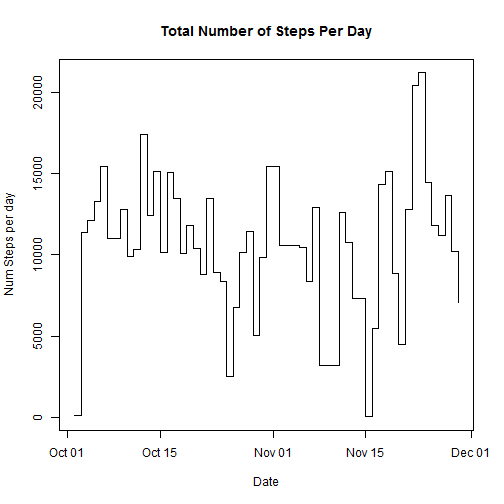
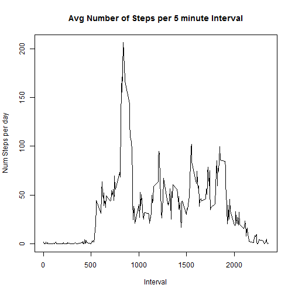
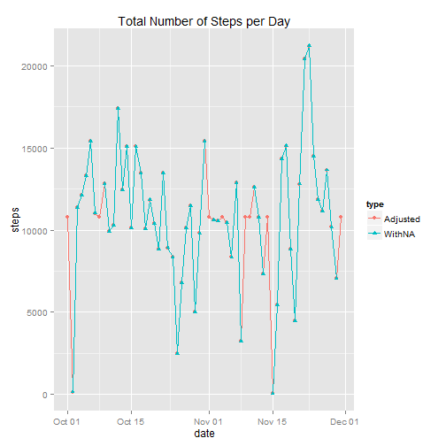
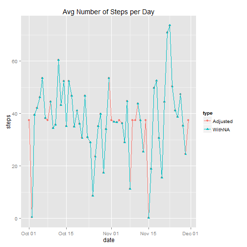
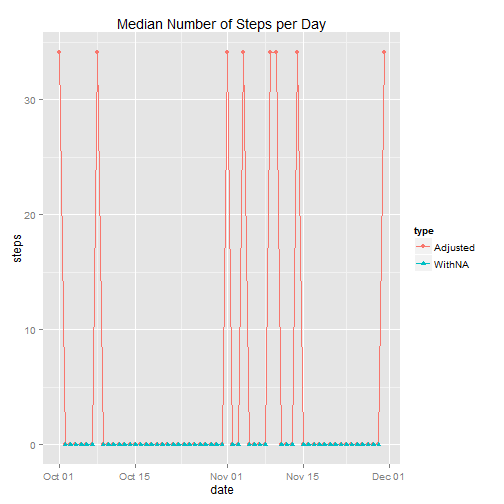
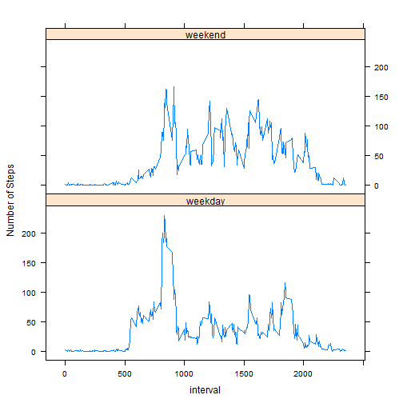

This is an R Markdown document. Markdown is a simple formatting syntax for authoring HTML, PDF, and MS Word documents. For more details on using R Markdown see <http://rmarkdown.rstudio.com>.

When you click the **Knit** button a document will be generated that includes both content as well as the output of any embedded R code chunks within the document. You can embed an R code chunk like this:


```r
    df <- read.csv("repdata-data-activity/activity.csv", header=TRUE)  
```
#What is mean total number of steps taken per day?

```r
#Calculate the total number of steps taken per day
sumstepeachday <- aggregate(steps ~ date, data=df, sum) #, na.rm=TRUE NA's are automatically excluded

#If you do not understand the difference between a histogram and a barplot, research the difference between them. Make a histogram of the total number of steps taken each day
converted <- as.Date(sumstepeachday$date, format="%Y-%m-%d")
#datevect=strptime(sumstepeachday$date, format="%Y-%m-%d")
plot(converted, sumstepeachday$steps, type="s", xlab="Date", ylab="Num Steps per day", main="Total Number of Steps Per Day")
```

 

```r
#Calculate and report the mean and median of the total number of steps taken per day
meanstepeachday <- aggregate(steps ~ date, data=df, mean, na.rm=TRUE)
meanstepeachday
```

```
##          date      steps
## 1  2012-10-02  0.4375000
## 2  2012-10-03 39.4166667
## 3  2012-10-04 42.0694444
## 4  2012-10-05 46.1597222
## 5  2012-10-06 53.5416667
## 6  2012-10-07 38.2465278
## 7  2012-10-09 44.4826389
## 8  2012-10-10 34.3750000
## 9  2012-10-11 35.7777778
## 10 2012-10-12 60.3541667
## 11 2012-10-13 43.1458333
## 12 2012-10-14 52.4236111
## 13 2012-10-15 35.2048611
## 14 2012-10-16 52.3750000
## 15 2012-10-17 46.7083333
## 16 2012-10-18 34.9166667
## 17 2012-10-19 41.0729167
## 18 2012-10-20 36.0937500
## 19 2012-10-21 30.6284722
## 20 2012-10-22 46.7361111
## 21 2012-10-23 30.9652778
## 22 2012-10-24 29.0104167
## 23 2012-10-25  8.6527778
## 24 2012-10-26 23.5347222
## 25 2012-10-27 35.1354167
## 26 2012-10-28 39.7847222
## 27 2012-10-29 17.4236111
## 28 2012-10-30 34.0937500
## 29 2012-10-31 53.5208333
## 30 2012-11-02 36.8055556
## 31 2012-11-03 36.7048611
## 32 2012-11-05 36.2465278
## 33 2012-11-06 28.9375000
## 34 2012-11-07 44.7326389
## 35 2012-11-08 11.1770833
## 36 2012-11-11 43.7777778
## 37 2012-11-12 37.3784722
## 38 2012-11-13 25.4722222
## 39 2012-11-15  0.1423611
## 40 2012-11-16 18.8923611
## 41 2012-11-17 49.7881944
## 42 2012-11-18 52.4652778
## 43 2012-11-19 30.6979167
## 44 2012-11-20 15.5277778
## 45 2012-11-21 44.3993056
## 46 2012-11-22 70.9270833
## 47 2012-11-23 73.5902778
## 48 2012-11-24 50.2708333
## 49 2012-11-25 41.0902778
## 50 2012-11-26 38.7569444
## 51 2012-11-27 47.3819444
## 52 2012-11-28 35.3576389
## 53 2012-11-29 24.4687500
```

```r
medianstepeachday <- aggregate(steps ~ date, data=df, median, na.rm=TRUE)
medianstepeachday
```

```
##          date steps
## 1  2012-10-02     0
## 2  2012-10-03     0
## 3  2012-10-04     0
## 4  2012-10-05     0
## 5  2012-10-06     0
## 6  2012-10-07     0
## 7  2012-10-09     0
## 8  2012-10-10     0
## 9  2012-10-11     0
## 10 2012-10-12     0
## 11 2012-10-13     0
## 12 2012-10-14     0
## 13 2012-10-15     0
## 14 2012-10-16     0
## 15 2012-10-17     0
## 16 2012-10-18     0
## 17 2012-10-19     0
## 18 2012-10-20     0
## 19 2012-10-21     0
## 20 2012-10-22     0
## 21 2012-10-23     0
## 22 2012-10-24     0
## 23 2012-10-25     0
## 24 2012-10-26     0
## 25 2012-10-27     0
## 26 2012-10-28     0
## 27 2012-10-29     0
## 28 2012-10-30     0
## 29 2012-10-31     0
## 30 2012-11-02     0
## 31 2012-11-03     0
## 32 2012-11-05     0
## 33 2012-11-06     0
## 34 2012-11-07     0
## 35 2012-11-08     0
## 36 2012-11-11     0
## 37 2012-11-12     0
## 38 2012-11-13     0
## 39 2012-11-15     0
## 40 2012-11-16     0
## 41 2012-11-17     0
## 42 2012-11-18     0
## 43 2012-11-19     0
## 44 2012-11-20     0
## 45 2012-11-21     0
## 46 2012-11-22     0
## 47 2012-11-23     0
## 48 2012-11-24     0
## 49 2012-11-25     0
## 50 2012-11-26     0
## 51 2012-11-27     0
## 52 2012-11-28     0
## 53 2012-11-29     0
```

#What is the average daily activity pattern?

```r
#Make a time series plot (i.e. type = "l") of the 5-minute interval (x-axis) and the average number of steps taken, averaged across all days (y-axis)
avgstepsperinterval <- aggregate(steps ~ interval, data=df, mean, na.rm=TRUE)
plot(avgstepsperinterval$interval, avgstepsperinterval$steps, type="l", xlab="Interval", ylab="Num Steps per day", main="Avg Number of Steps per 5 minute Interval")
```

 

```r
#Which 5-minute interval, on average across all the days in the dataset, contains the maximum number of steps?
avgstepsperinterval$interval[avgstepsperinterval$steps==max(avgstepsperinterval$steps)]
```

```
## [1] 835
```
#Imputing missing values
##Devise a strategy for filling in all of the missing values in the dataset. 
##The strategy does not need to be sophisticated. 
##For example, you could use the mean/median for that day, or the mean for that 5-minute interval, etc.

#As there are definately trends throughout the day, it seems like the most reasonable would be to use the mean of the interval

```r
library(ggplot2)
#Calculate and report the total number of missing values in the dataset (i.e. the total number of rows with NAs)
sum(is.na(df$steps))
```

```
## [1] 2304
```

```r
#Create a new dataset that is equal to the original dataset but with the missing data filled in.
#copy original data, work with the copy
dfAdj<-df
#logical vector marking NA's
nasteps<-is.na(dfAdj$steps)
#replace NA's with mean
dfAdj$steps[nasteps]<-avgstepsperinterval$steps
#verifying are there any NA's? should be 0
sum(is.na(dfAdj$steps))
```

```
## [1] 0
```

```r
#Make a histogram of the total number of steps taken each day 
sumstepeachdayADJ <- aggregate(steps ~ date, data=dfAdj, sum, na.rm=TRUE)
sumstepeachdayADJ<-cbind(sumstepeachdayADJ, type=c("Adjusted"))
#sumstepeachdayADJ$date <- as.Date(sumstepeachdayADJ$date, format="%Y-%m-%d")

#get a data frame which aggregates, but leaves NA's so can be merged with adjusted (NA's replace by mean) data frame (all dates)
sumstepeachdaywithNA <- aggregate(steps ~ date, data=df, sum,   na.action=NULL) # keep NA's in data frame
sumstepeachdaywithNA<-cbind(sumstepeachdaywithNA, type=c("WithNA"))
sumstepTOT<-rbind(sumstepeachdayADJ, sumstepeachdaywithNA)
sumstepTOT$date <- as.Date(sumstepTOT$date, format="%Y-%m-%d")
g<-ggplot(sumstepTOT, aes(date, steps,  group=type, shape=type, colour=type))+geom_line()+labs(title="Total Number of Steps per Day")
p<-g+geom_point()
print(p)
```

```
## Warning: Removed 2 rows containing missing values (geom_path).
```

```
## Warning: Removed 8 rows containing missing values (geom_point).
```

 

```r
#numbers are identical except for the days which contain NA's. Chart shows overlapping lines.

#and Calculate and report the mean and median total number of steps taken per day. 
#Do these values differ from the estimates from the first part of the assignment? 
meanstepeachdayADJ <- aggregate(steps ~ date, data=dfAdj, mean, na.rm=TRUE)
meanstepeachdayADJ<-cbind(meanstepeachdayADJ, type=c("Adjusted"))
meanstepeachdaywithNA <- aggregate(steps ~ date, data=df, mean,   na.action=NULL) # keep NA's in data frame
meanstepeachdaywithNA<-cbind(meanstepeachdaywithNA, type=c("WithNA"))
meanstepTOT<-rbind(meanstepeachdayADJ, meanstepeachdaywithNA)
meanstepTOT$date <- as.Date(meanstepTOT$date, format="%Y-%m-%d")
g<-ggplot(meanstepTOT, aes(date, steps,  group=type, shape=type, colour=type))+geom_line()+labs(title="Avg Number of Steps per Day")
p<-g+geom_point()
print(p)
```

```
## Warning: Removed 2 rows containing missing values (geom_path).
```

```
## Warning: Removed 8 rows containing missing values (geom_point).
```

 

```r
#mean is identical except for the days which contain NA's. Chart shows overlapping lines.

medstepeachdayADJ <- aggregate(steps ~ date, data=dfAdj, median, na.rm=TRUE)
medstepeachdayADJ<-cbind(medstepeachdayADJ, type=c("Adjusted"))
medstepeachdaywithNA <- aggregate(steps ~ date, data=df, median,   na.action=NULL) # keep NA's in data frame
medstepeachdaywithNA<-cbind(medstepeachdaywithNA, type=c("WithNA"))
medstepTOT<-rbind(medstepeachdayADJ, medstepeachdaywithNA)
medstepTOT$date <- as.Date(medstepTOT$date, format="%Y-%m-%d")
g<-ggplot(medstepTOT, aes(date, steps,  group=type, shape=type, colour=type))+geom_line()+labs(title="Median Number of Steps per Day")
p<-g+geom_point()
print(p)
```

```
## Warning: Removed 2 rows containing missing values (geom_path).
```

```
## Warning: Removed 8 rows containing missing values (geom_point).
```

 

```r
#What is the impact of imputing missing data on the estimates of the total daily number of steps?
##median is way higher - because the median is 0 for each day, inserting the mean across each 5-min interval
##significantly raises the median as each day is composed mostly of zeros except the missing days with NAs
```
#Are there differences in activity patterns between weekdays and weekends?

```r
weekend<-weekdays(as.Date(dfAdj$date)) %in% c("Saturday","Sunday") 
dfAdj$DOW[weekend]<-"weekend"
dfAdj$DOW[!weekend]<-"weekday"
#dfPlotweekend=dfAdj[weekend,]
#dfPlotweekday=dfAdj[!weekend,]
dfAdjAgg <- aggregate(steps ~ interval+DOW, data=dfAdj, mean)
#dfAdjweekendAgg <- aggregate(steps ~ interval+DOW, data=dfPlotweekend, mean)
#dfAdjweekdayAgg <- aggregate(steps ~ interval+DOW, data=dfPlotweekday, mean)

library(lattice)
xyplot(dfAdjAgg$steps~dfAdjAgg$interval|dfAdjAgg$DOW, layout=c(1,2) , ylab="Number of Steps", xlab="interval",type="l")
```

 

```r
#par(mfrow=c(2,1))
#plot(dfAdjweekendAgg$interval, dfAdjweekendAgg$steps, ylab="Number of Steps", xlab="interval",type="l")
#plot(dfAdjweekdayAgg$interval, dfAdjweekdayAgg$steps, ylab="Number of Steps", xlab="interval", type="l")
#dev.off
```
